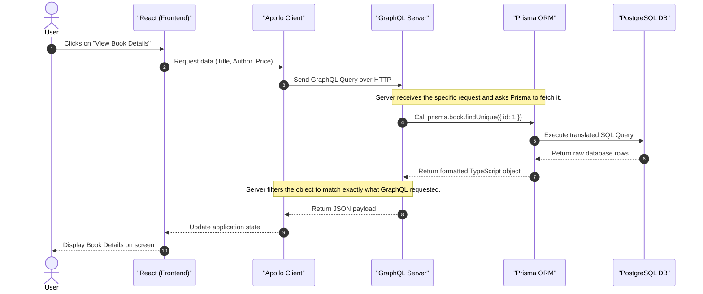

# Bookstore Architecture Guide

Welcome to the Bookstore project! This document explains how the different pieces of our technology stack work together in simple terms.

## 🏗️ The Technology Stack

Our application is built using a modern, three-tier architecture:

1. **Frontend (React & Apollo Client):** The user interface where customers browse books and admins manage the store.
2. **Backend (GraphQL API):** The "middleman" that handles requests from the frontend and figures out what data is needed.
3. **Database (PostgreSQL & Prisma):** The digital filing cabinet where all our data (books, users, orders) is safely stored.

---

## 🔍 Understanding GraphQL & Prisma

### What is GraphQL?
Imagine you go to a restaurant. In a traditional API (REST), you have to order fixed combo meals (e.g., "Give me the Book Combo"). If you only want the book's title and author, but the combo includes the price, stock, and 50 reviews, you end up wasting bandwidth carrying food you didn't want.

**GraphQL** is like a buffet where you hand the chef an exact list of what you want. 
If the frontend asks: *"Give me the title and price of book #5"*, the GraphQL API responds with **exactly** those two pieces of information, nothing more, nothing less. It makes the app significantly faster and more efficient.

### What is Prisma?
Databases speak their own complex language called SQL. Writing raw SQL can be tedious and prone to human error. 

**Prisma** is our translator (specifically, an Object-Relational Mapper or ORM). Instead of writing raw SQL queries, our backend developers write simple JavaScript/TypeScript commands (like `prisma.book.findMany()`). Prisma safely translates those commands into optimized SQL, talks to the PostgreSQL database, and hands the data back to us as clean, easy-to-use JavaScript objects.

---

## 🔄 The Data Workflow (Sequence Diagram)

Here is a step-by-step visual representation of what happens when a user clicks on a book to view its details.

## 📝 Summary of the Workflow

1. **Action:** The user interacts with the app (e.g., clicks "Add to Cart" or loads the shop page).
2. **Request:** The React frontend uses **Apollo Client** to formulate a precise **GraphQL** query.
3. **Handling:** The GraphQL Server receives the query and triggers a "resolver" function.
4. **Database Translation:** The resolver uses **Prisma** to ask the PostgreSQL database for the data.
5. **Response:** The database gives the data to Prisma, Prisma hands it to GraphQL, and GraphQL sends exactly what was requested back to the Frontend.
