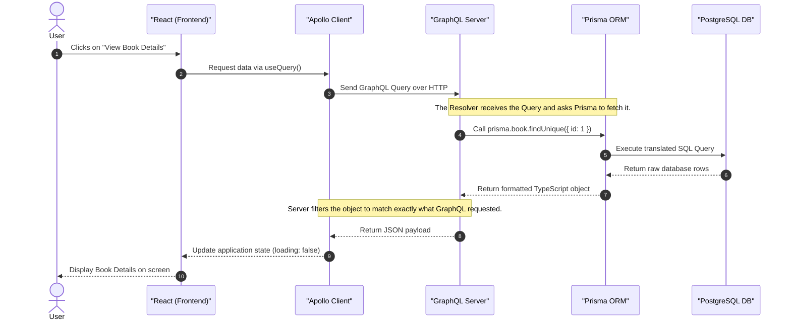

# Bookstore Architecture Guide

Welcome to the Bookstore project! This document explains how the different pieces of our technology stack work together in simple terms.

## 🏗️ The Technology Stack

Our application is built using a modern, three-tier architecture:

1. **Frontend (React & Apollo Client):** The user interface where customers browse books and admins manage the store.
2. **Backend (GraphQL API):** The "middleman" that handles requests from the frontend and figures out what data is needed.
3. **Database (PostgreSQL & Prisma):** The digital filing cabinet where all our data (books, users, orders) is safely stored.

---

## 🔍 Understanding GraphQL

GraphQL is like a smart buffet where you hand the chef an exact list of what you want. Instead of traditional APIs where you get a fixed "combo meal" of data, GraphQL lets you ask for exactly what you need—nothing more, nothing less.

Here are the four main building blocks of our GraphQL setup:

### 1. TypeDefs (The Contract / The Menu)
**TypeDefs** (Type Definitions) are the blueprints of our data. They define exactly what objects exist and what fields they have. It's the strict contract between the frontend and backend.
*Example:* "A `Book` has an `id` (Number), a `title` (Text), and a `price` (Decimal)."

### 2. Queries (Reading Data)
A **Query** is how the frontend asks the backend to *read* or *fetch* data. It's the equivalent of a `GET` request in traditional APIs.
*Example:* "Please give me a list of all books, but I only need their `title` and `price`."

### 3. Mutations (Writing Data)
A **Mutation** is how the frontend asks the backend to *change* data—like creating, updating, or deleting something. It's the equivalent of `POST`, `PUT`, or `DELETE` requests.
*Example:* "Add this new book to the database, and return its new `id` to me so I know it succeeded."

### 4. Resolvers (The Chefs)
When a Query or Mutation comes in, GraphQL needs to know *how* to actually get or change that data. **Resolvers** are the backend JavaScript functions that execute the logic. They are the "chefs" that look at the order and go to the pantry (the database) to get the ingredients.

---

## 🔌 The Client (Apollo Client)

If GraphQL is the language we speak, **Apollo Client** is the smart smartphone we use to make the call. 

Instead of writing complex `fetch()` requests manually in React, we use Apollo Client on the frontend. It provides simple React hooks like `useQuery()` and `useMutation()`.
* **Smart Caching:** When you fetch a list of books, Apollo saves it in memory. If you go to another page and come back, it instantly loads from the cache instead of asking the database again.
* **State Management:** It automatically tracks if a request is `loading`, if there is an `error`, or if the `data` is ready, saving us from writing dozens of boilerplate variables.

---

## 🗄️ Understanding Prisma

Databases speak their own complex language called SQL. Writing raw SQL can be tedious and prone to human error. 

**Prisma** is our translator (an Object-Relational Mapper or ORM) used inside our GraphQL Resolvers. Instead of writing raw SQL strings, backend developers write simple TypeScript commands like `prisma.book.findMany()`. Prisma safely translates those commands into optimized SQL, talks to PostgreSQL, and hands the data back to us as clean JavaScript objects.

---

## 🔄 The Data Workflow (Sequence Diagram)

Here is a step-by-step visual representation of what happens when a user clicks on a book to view its details.

